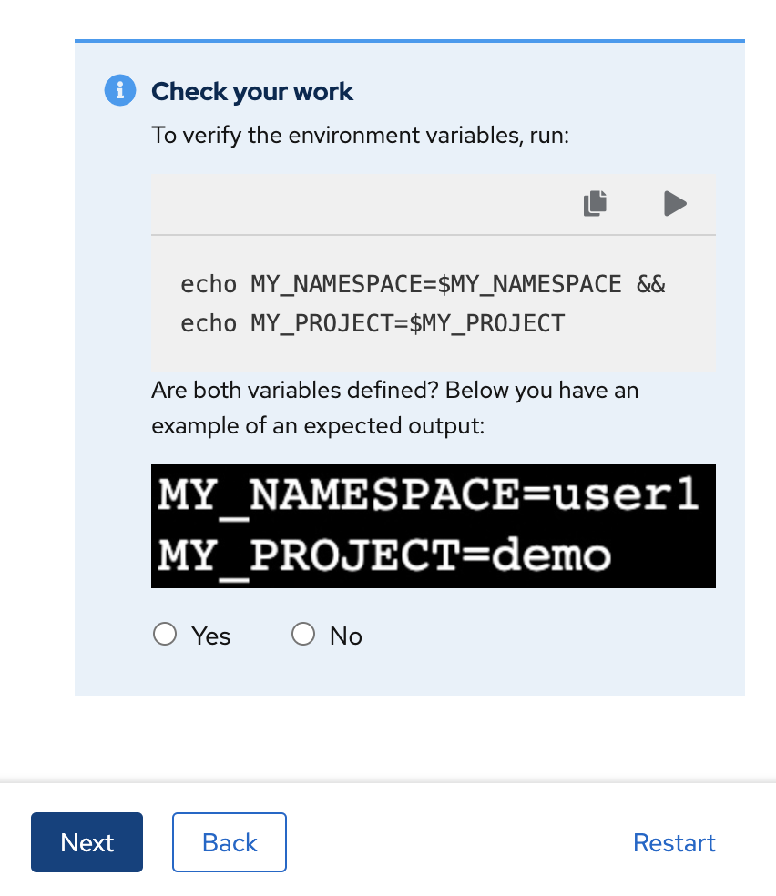

# OpenShift Serverless Quick Start

This repo contains some OpenShift Serverless Quickstarts. A quick start is a guided tutorial with user tasks to be executed using the OpenShift Web Console. They are especially useful for getting started with an application, Operator, or other product offering.





## How to install

To install on OpenShift, run:

```bash
# NodeJS
oc apply -f https://raw.githubusercontent.com/luszczynski/openshift-serverless-quickstart/main/quickstarts/node-faas-quickstart.yaml

# GO
oc apply -f https://raw.githubusercontent.com/luszczynski/openshift-serverless-quickstart/main/quickstarts/go-faas-quickstart.yaml

# Quarkus
oc apply -f https://raw.githubusercontent.com/luszczynski/openshift-serverless-quickstart/main/quickstarts/quarkus-faas-quickstart.yaml

# Python
oc apply -f https://raw.githubusercontent.com/luszczynski/openshift-serverless-quickstart/main/quickstarts/python-faas-quickstart.yaml

# Rust
oc apply -f https://raw.githubusercontent.com/luszczynski/openshift-serverless-quickstart/main/quickstarts/rust-faas-quickstart.yaml

# SpringBoot
oc apply -f https://raw.githubusercontent.com/luszczynski/openshift-serverless-quickstart/main/quickstarts/springboot-faas-quickstart.yaml

# Typescript
oc apply -f https://raw.githubusercontent.com/luszczynski/openshift-serverless-quickstart/main/quickstarts/typescript-faas-quickstart.yaml
```
